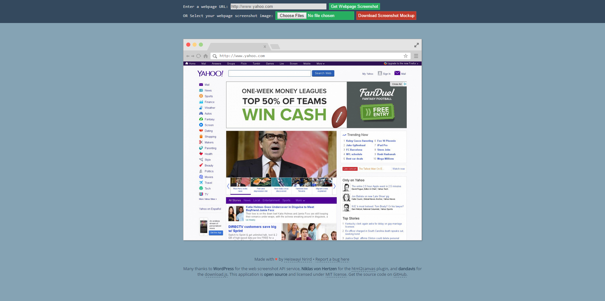

# webpage-screenshot

Webpage Screenshot Mockup Generator for Blog or Website Content

**URL:** http://wayi.me/webpage-screenshot

### The Idea

To create a webpage screenshot generator with a Google Chrome browser-like frame mockup to be used as a web screenshot image in a blog post or website content.

### Note

I have to use PHP cURL due to limitation in [html2canvas](http://html2canvas.hertzen.com/documentation.html) where all the images that the script uses need to reside under the [same origin](http://en.wikipedia.org/wiki/Same_origin_policy) for it to be able to read them without the assistance of a proxy.

### Application Workflow

1. User can insert a remote webpage URL `OR` user can select a webpage screenshot image file.
2. If user uses the remote webpage URL, user needs to click on **Get Webpage Screenshot** button to generate a webpage screenshot inside Google Chrome browser-like frame mockup.
3. Else, the webpage screenshot image will be auto-generated inside the Google Chrome browser-like frame mockup.
4. User clicks on **Download Screenshot Mockup** button to download the new generated webpage screenshot together with the Google Chrome browser-like frame mockup.

### Screenshots

_The Generator_

_The Final Result_

### TODO

* [x] Google Chrome browser-like frame mockup as the screenshot wrapper.
* [x] Control to input a webpage URL for automatic screenshot generation.
* [ ] ~~Create self-hosted web screenshot service.~~ Currently using `http://s.wordpress.com/mshots/v1/` with image width `?w=1200`.
* [ ] ~~OR looking for better web screenshot API service?~~
* [x] Generate/preview web screenshot in the Google Chrome browser-like frame mockup.
* [x] Upload web screenshot and preview in the Google Chrome browser-like frame mockup.
* [ ] A ~~big~~ special button for download new generated screenshot with the Google Chrome browser-like frame mockup.
* [x] **Module for generating a new screenshot image with the Google Chrome browser-like frame mockup which able to select particular `div` element in the HTML DOM.**
* [x] Output and download the new generated screenshot image in `PNG` format.

### Project Status

Version 1.0

### Credits

* [**WordPress**](https://wordpress.com/) - Webpage screenshot API service for remote URL
* [html2canvas](http://html2canvas.hertzen.com/) by **Niklas von Hertzen** - To take "screenshots" of webpages or parts of it, directly on the users browser.
* [download.js](http://danml.com/download.html) by **dandavis** - Client-side file downloading using JS and HTML5

### License

MIT License

---

Made with love by [Heiswayi Nrird](http://heiswayi.github.io) in Sept. 2015
